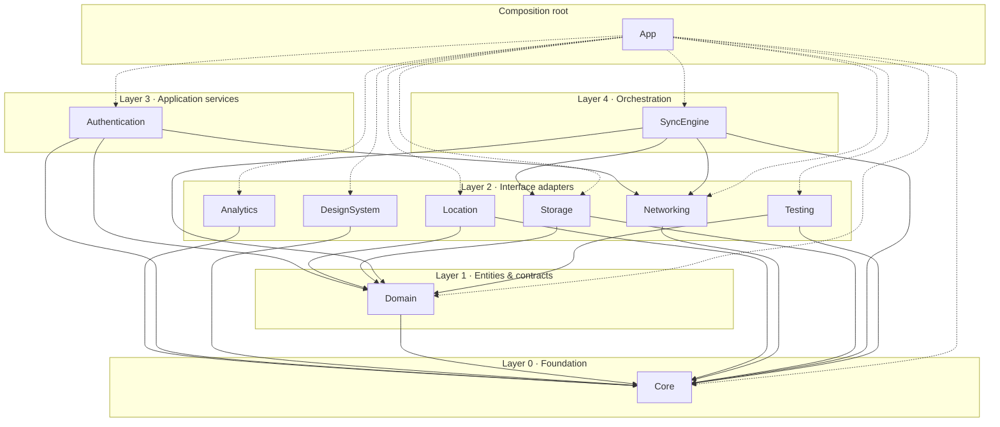

# DriverTracker — Package Dependency Architecture

Clean Architecture applied to Swift Packages. Dependencies point inward only;
abstractions live in Domain, implementations live in adapters, wiring lives in the App.

Verified by `Scripts/check-graph.py` (cycles + dependency rule) and
`Scripts/check-architecture.sh` (dependency whitelist). Last verified state:
**10 packages, 17 edges, 0 cycles, all edges point strictly inward.**

Dashed edges: the App target (composition root) may depend on everything — it is the only
place where concrete implementations are constructed and injected.

## Layers

| Layer | Name | Packages | Rule |
|---|---|---|---|
| 0 | Foundation | Core | Depends on nothing |
| 1 | Entities & contracts | Domain | Business model + protocol declarations |
| 2 | Interface adapters | Networking, Storage, Location, Analytics, DesignSystem, Testing | Framework-facing implementations, one concern each |
| 3 | Application services | Authentication | Coordinates adapters for a cross-cutting concern |
| 4 | Orchestration | SyncEngine | Only module allowed to combine Networking + Storage |
| 5 | Composition root | App target | Wires implementations into Domain protocols |

## Every dependency, justified (17 edges)

| # | Edge | Why it exists |
|---|---|---|
| 1 | Domain → Core | Entities/value objects use shared utilities (errors, IDs, formatting) without framework coupling |
| 2 | Networking → Core | Error types, logging, config (API base URL) |
| 3 | Storage → Core | Shared utilities used in mapping and migration code |
| 4 | Storage → Domain | Implements Domain repository protocols; maps persistence models to entities |
| 5 | Location → Core | Shared utilities (errors, coordinate formatting) |
| 6 | Location → Domain | Emits Domain value objects (`Coordinates`), reads Domain geofence/trip contracts |
| 7 | Analytics → Core | Logging/config only. Deliberately **not** Domain — stays domain-agnostic |
| 8 | DesignSystem → Core | Shared utilities only. Deliberately **not** Domain — stays a generic component kit |
| 9 | Testing → Core | Fixtures use core utilities |
| 10 | Testing → Domain | Provides fakes for Domain protocols and entity fixtures |
| 11 | Authentication → Core | Error types, logging |
| 12 | Authentication → Domain | Implements Domain-declared `SessionTokenProvider`; models session with Domain types |
| 13 | Authentication → Networking | Performs sign-in/refresh API calls through the HTTP client |
| 14 | SyncEngine → Core | Queue/error/retry primitives |
| 15 | SyncEngine → Domain | Operates on entities and repository protocols |
| 16 | SyncEngine → Networking | Push/pull through remote repository implementations |
| 17 | SyncEngine → Storage | Local repositories + persisted change queue |

## Dependency inversion points

Clean Architecture's inversion rule in practice — *who declares, who implements, who consumes*:

| Abstraction | Declared in | Implemented by | Consumed by |
|---|---|---|---|
| `TripRepository` / `DriverRepository` | Domain | Storage (local), Networking (remote) | SyncEngine, features |
| `SessionTokenProvider` | Domain | Authentication | Networking, SyncEngine |
| `LocationTracker` (if swapping is needed) | Domain | Location | Features, Testing fakes |
| `AnalyticsClient` | Analytics (facade *is* the abstraction) | Analytics | Features, App |

Key consequence: **Networking and SyncEngine never import Authentication.** They ask for a
`SessionTokenProvider`; the App injects the Authentication implementation. That is what keeps
edge 13 one-directional forever.

## Why no cycles can form

A cycle requires at least one edge pointing to an equal or higher layer.
`check-graph.py` rejects any edge that does not point strictly inward (L(n) > L(d)),
and `check-architecture.sh` rejects any edge outside the whitelist. Together they make
circular dependencies unrepresentable, not merely detectable. Kahn's topological sort
additionally proves the current graph acyclic and yields a valid build order:
`Core → Analytics → DesignSystem → Domain → Networking → Authentication → Location → Storage → Testing → SyncEngine`.

## Recommendations before implementation

1. **Fix Networking manifest gap (real finding).** `Packages/Networking/Package.swift`
   declares only `Core`, but its README contract and responsibilities (implement Domain
   repository protocols, map DTOs to entities) require `Domain`. Add
   `.package(path: "../Domain")` now — the whitelist already permits it.
2. **Declare `SessionTokenProvider` in Domain first**, before writing any auth or networking
   code. This single protocol is what prevents the Auth↔Networking coupling that most apps
   drift into.
3. **Write an ADR for the persistence choice** (SwiftData vs CoreData) before touching
   Storage. Storage is the costliest package to migrate later; everything else swaps cheaply.
4. **Reserve a Features layer (L3.5) in your head, not in code yet.** When screens arrive,
   build per-feature packages (e.g., `TripFeature`) depending on Domain + DesignSystem +
   Analytics facade. The App target must stay composition-only; if a feature's logic lives
   in the App target, the architecture has already drifted.
5. **Keep HTTP stubbing out of Testing.** Network test doubles belong in Networking's own
   test target. Testing provides *Domain-protocol* fakes only — this keeps the forbidden-deps
   list for Testing stable as the project grows.
6. **Do not add packages to the App target until consumed.** Each package enters the Xcode
   project the day a feature imports it — keeps project diffs reviewable and build times honest.
