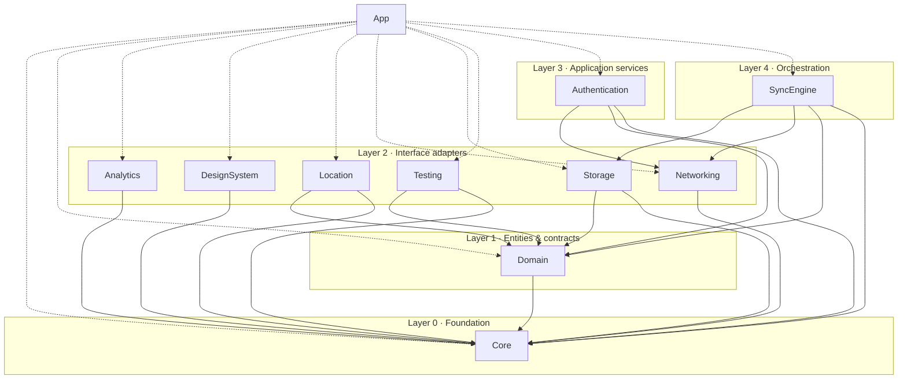

# DriverTracker

iOS driver trip-tracking app built with SwiftUI, structured as Clean Architecture Swift packages.

## Overview

Monorepo layout designed for modular growth. The app shell lives in `App/`, and all business
logic lives in local Swift packages under `Packages/` following the Clean Architecture
dependency rule: dependencies point strictly inward.



## Packages

| Package | Layer | Depends on | Responsibility |
|---|---|---|---|
| Core | 0 | — | Foundation utilities: logging, errors, formatting |
| Domain | 1 | Core | Entities, value objects, repository protocols |
| Networking | 2 | Core | HTTP transport, DTOs, API client |
| Storage | 2 | Core, Domain | Persistence, repository implementations |
| Location | 2 | Core, Domain | GPS tracking, geofencing |
| Analytics | 2 | Core | Event tracking facade |
| DesignSystem | 2 | Core | UI tokens, reusable components |
| Testing | 2 | Core, Domain | Test doubles, fixtures (test targets only) |
| Authentication | 3 | Core, Domain, Networking | Sessions, tokens, sign-in flows |
| SyncEngine | 4 | Core, Domain, Networking, Storage | Offline sync orchestration |

Full contract per package: see each `Packages/*/README.md` (purpose, responsibilities,
allowed/forbidden dependencies). Dependency graph + edge justification:
[`Docs/architecture.md`](Docs/architecture.md).

## Prerequisites

- Xcode 26.5+ (the project uses `PBXFileSystemSynchronizedRootGroup` and Xcode 26 features)
- Swift 6.x toolchain
- iOS 18.0+ simulator/device

## Building

Open the app:

```sh
open App/DriverTracker.xcodeproj
```

Build the app from the CLI:

```sh
xcodebuild -project App/DriverTracker.xcodeproj -target DriverTracker \
  -configuration Debug -destination 'generic/platform=iOS Simulator' \
  CODE_SIGNING_ALLOWED=NO build
```

Build a package standalone (e.g. Domain):

```sh
swift build --package-path Packages/Domain
```

## Build configurations

| Configuration | Purpose |
|---|---|
| Debug | Development. No optimization, `ENABLE_TESTABILITY`, debug dylibs |
| Release | App Store. Whole Module Optimization, stripped symbols, dSYMs |
| Staging | Release-identical + `STAGING` compilation condition, `eddy.DriverTracker.staging` bundle ID (installs alongside prod) |

Every setting explained in [`Docs/build-settings.md`](Docs/build-settings.md).

## Architecture checks

The repository enforces its own boundaries. Run before pushing:

```sh
Scripts/check-architecture.sh   # package dependency whitelist
Scripts/check-graph.py          # cycle detection + inward-dependency rule, emits Mermaid
```

Both run in CI on every push/PR. A PR that adds a forbidden dependency or a cycle is
rejected automatically.

## Repository layout

```
App/          Xcode project + app target source
Packages/     10 local Swift packages (Clean Architecture modules)
Docs/         architecture.md, build-settings.md
ADR/          Architecture Decision Records
Scripts/      check-architecture.sh, check-graph.py
Resources/    shared non-source assets (fonts, images, fixtures)
.github/      CI workflows, issue/PR templates
```

## Contributing

See [`CONTRIBUTING.md`](CONTRIBUTING.md).

## License

MIT — see [`LICENSE`](LICENSE).
